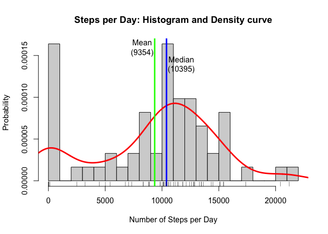

# Reproducible Research: Peer Assessment 1
Matthew McGuire  

## Loading and preprocessing the data

We begin by loading the data set into a data frame and formatting the date column properly.


```r
library(lubridate)
library(ggplot2)

## Load the data set
setwd("~/Dropbox/__ summer 2015/_Reproducible Research/Project")
stepsData <- read.csv("activity.csv") 

## Preprocessing
# create PosixCT dates from data field with Lubridate
stepsData$date <- ymd(stepsData$date)
head(stepsData)
```

```
##   steps       date interval
## 1    NA 2012-10-01        0
## 2    NA 2012-10-01        5
## 3    NA 2012-10-01       10
## 4    NA 2012-10-01       15
## 5    NA 2012-10-01       20
## 6    NA 2012-10-01       25
```


## What is the total number of steps taken per day?


```r
# create a data frame storing total steps per day
aggregSteps <- as.data.frame(tapply(stepsData[,1], as.factor(stepsData[,2]), sum, na.rm=TRUE))
names(aggregSteps) <- "StepsPerDay"

# calculate the mean and median steps per day
meanStepsPerDay <- round(mean(aggregSteps[,1]),1)
medianStepsPerDay <- median(aggregSteps[,1])
spdDensity <- density(aggregSteps[,1])

# plot a historgram of the data
hist(aggregSteps[,1], breaks=18, col="lightgrey", xlab="Number of Steps per Day", 
     ylab="Probability", probability = TRUE, main="Steps per Day: Histogram and Density curve")
# add a density curve
lines(density(aggregSteps[,1]), col="red", lwd=3)
# add vertical lines for mean and median 
abline(v=meanStepsPerDay, lwd=3, col="green")
text(meanStepsPerDay-1100, .00016, "Mean\n(9354)")
abline(v=medianStepsPerDay, lwd=3, col="blue")
text(medianStepsPerDay+1300, .00014, "Median\n(10395)")
rug(aggregSteps[,1])
```

 

Of the 61 days that appear in the data set (ignoring NA intervals): 

- The mean steps per day is $9354.2$.
- The median steps per day is $10395$.

## What is the average daily activity pattern?


```r
## create a data frame to hold total steps and mean steps per interval 
aggregIntervals <- as.data.frame(tapply(stepsData[,1], as.factor(stepsData[,3]), sum, na.rm=TRUE))
names(aggregIntervals) <- "StepsPerInterval"
aggregIntervals$IntervalName <- as.character(row.names(aggregIntervals))
aggregIntervals$MeanStepsPerInterval <- tapply(stepsData[,1], as.factor(stepsData[,3]), mean, na.rm=TRUE)
## plot a time series of average steps per interval, with maximum interval marked and labeled
with(aggregIntervals, plot(IntervalName, MeanStepsPerInterval, type="l", col = "blue", lwd=3,
                           xlab="Five-minute interval", ylab="Average Steps", main="Average Steps per Interval"))
abline(v=aggregIntervals[ aggregIntervals$MeanStepsPerInterval==max(aggregIntervals$MeanStepsPerInterval),2], col="red", lwd=1)
text(x=600,y=200,"Max: at 8:35\n(206.17 steps)")
```

 

The most active five-minute interval is 8:35, which has a mean of $206.17$ steps.

## Imputing missing values


```r
naDaysIntervals <- sum(is.na(stepsData[,c(2,3)]))
naSteps <- sum(is.na(stepsData[,c(2,3)]))
cat(naSteps)
```

```
## 0
```

There are $2304$ intervals without data.

In order to impute data to replace the 'NA' entries, we take two preparatory steps.  
For each day in the data set:
1. Calculate the percentage of the intervals for that day having NA
2. Calculate the impute weight of the day - the relative activity level of that day compared to average

Now, having made a copy of the steps Data set, we consider each NA, and replace it with
this value: the mean weight for its interval (across all days) times the impute weight for that particular day


```r
# create two new columns in aggregateSteps to store:
# PercIntervalsNA:  % of intervals set to NA
# ImputeWeight: impute weight of each day (i.e. the activity level of that day cp. to mean activity) 
aggregSteps$PercIntervalsNA <- rep(0.0, dim(aggregSteps)[1])
aggregSteps$ImputeWeight <- rep(1.0, dim(aggregSteps)[1])

# calculate the PercIntervalsNA ( % of intervals set to NA) for each activity date
for (i in row.names(aggregSteps)) 
{
    a <-sum(is.na(stepsData[stepsData$date==ymd(i),1]))
    b <-sum(!is.na(stepsData[stepsData$date==ymd(i),1]))
    aggregSteps[i,"PercIntervalsNA"] <- b/(a+b)
}

# calculate the ImputeWeight for each day.
# it is already set to 1 by default. If PercIntervalsNA > 0.5, 
# it is adjusted up or down relative to mean activity for that day compared to all days
# (0.5 i.e. at least half the intervals that day have actual data on which to base an aggregate judgment)
for (i in row.names(aggregSteps)) 
{
    if (aggregSteps[i,"PercIntervalsNA"] > 0.5) 
    {
        aggregSteps[i,"ImputeWeight"] <- aggregSteps[i,"StepsPerDay"]/meanStepsPerDay
    }
}

# make a copy of the stepsData and impute values for NA
# NA = impute weight for day * mean activty for that interval across all days
stepsDataImputed <- stepsData
for (i in 1:dim(stepsData)[1])
{
    if(is.na(stepsDataImputed[i,"steps"]))
    {
        intervalNA <- as.character(stepsDataImputed[i,"interval"])
        dateNA <- as.character(stepsDataImputed[i,"date"])
        stepsDataImputed[i,"steps"] <- 
            aggregIntervals[intervalNA,"MeanStepsPerInterval"] * aggregSteps[dateNA,"ImputeWeight"]
    }
}
```


Finally, for the imputed data set, we make a histogram of the total number of steps taken each day. 
We then calculate and report the mean and median total number of steps taken per day. 


```r
# create a data frame storing total steps per day
aggregImputed <- as.data.frame(tapply(stepsDataImputed[,1], as.factor(stepsDataImputed[,2]), sum, na.rm=TRUE))
names(aggregImputed) <- "StepsPerDay"

# calculate the mean and median steps per day
meanImputedStepsPerDay <- round(mean(aggregImputed[,1]),1)
medianImputedStepsPerDay <- round(median(aggregImputed[,1]),1)
spdImputedDensity <- density(aggregImputed[,1])

# plot a histogram of the data
hist(aggregImputed[,1], breaks=18, col="lightgrey", xlab="Number of Steps per Day", 
     ylab="Probability", probability = TRUE, main="Steps per day (Imputed)")
# add a density curve
lines(density(aggregImputed[,1]), col="red", lwd=3)
# add vertical lines for mean and median 
abline(v=meanImputedStepsPerDay, lwd=3, col="green")
text(meanImputedStepsPerDay-1100, .00016, "Mean\n(10766)")
abline(v=medianImputedStepsPerDay, lwd=3, col="blue")
text(medianImputedStepsPerDay+1300, .00014, "Median\n(10766)")
rug(aggregImputed[,1])
```

 


Having imputed into the NA intervals: 

- The mean steps per day is $10766.2$.
- The median steps per day is $10766.2$.

These values are considerably higher than previously noted, since the days of zero activity are 
now less influential in these statistics.

## Are there differences in activity patterns between weekdays and weekends?


```r
library(dplyr)
library(lattice)
# create a factor variable noting 'weekday' or 'weekend' on step data
weekLabel <- c("weekend", "weekday")
stepsDataImputed$weekPart <- factor(wday(stepsDataImputed$date) %in% c(1,7), labels=weekLabel)

# create a data frame of mean steps per interval, factored by weekday/weekend
# nb: there is no doubt a more efficient way, but here are data frames made separately
#     for weekdays and weekends, then combined
t1 <- filter(stepsDataImputed, weekPart=="weekend")
t2 <- filter(stepsDataImputed, weekPart!="weekend")
t1DF <- as.data.frame(tapply(t1[,1], as.factor(t1[,3]), mean))
names(t1DF) <- "StepsPerInterval"
t1DF$weekPart <- as.factor("weekend")
t1DF$interval <- as.integer(row.names(t1DF))
t2DF <- as.data.frame(tapply(t2[,1], as.factor(t2[,3]), mean))
names(t2DF) <- "StepsPerInterval"
t2DF$weekPart <- as.factor("weekday")
t2DF$interval <- as.integer(row.names(t2DF))
aggregIntervalsFactored <- rbind(t1DF,t2DF)

# make a lattice plot of the 
xyplot(StepsPerInterval ~ interval| weekPart, data=aggregIntervalsFactored, type='l', 
       layout = c(1, 2), xlab="Interval", ylab = "Steps per Interval", main="Steps per Interval, Factored")
```

 

Judging by the evidence above, we might conclude that weekend and weekday activity patterns differ considerably. 
On the weekends, there is a higher peak of activity in the mornings, but the rest of the day is more sedentary than on weekdays.
