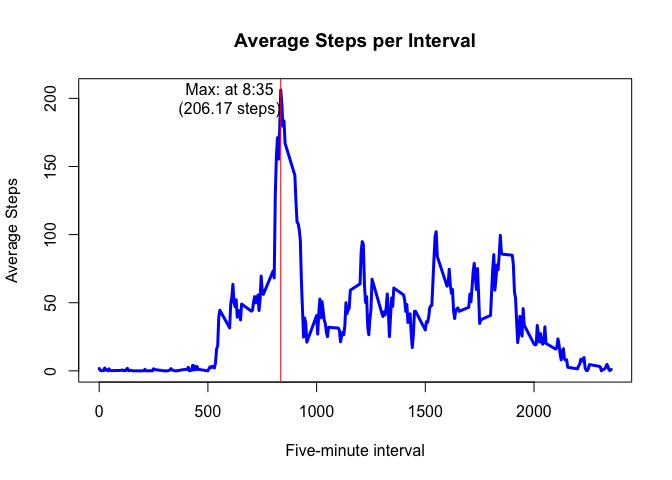

# Reproducible Research: Peer Assessment 1
Matthew McGuire  

## Loading and preprocessing the data

We begin by loading the data set into a data frame and formatting the date column properly.


```r
library(lubridate)
library(ggplot2)

## Load the data set
setwd("~/Dropbox/__ summer 2015/_Reproducible Research/Project")
stepsData <- read.csv("activity.csv") 

## Preprocessing
# create PosixCT dates from data field with Lubridate
stepsData$date <- ymd(stepsData$date)
head(stepsData)
```

```
##   steps       date interval
## 1    NA 2012-10-01        0
## 2    NA 2012-10-01        5
## 3    NA 2012-10-01       10
## 4    NA 2012-10-01       15
## 5    NA 2012-10-01       20
## 6    NA 2012-10-01       25
```


## What is the total number of steps taken per day?


```r
# create a data frame storing total steps per day
aggregData <- as.data.frame(tapply(stepsData[,1], as.factor(stepsData[,2]), sum, na.rm=TRUE))
names(aggregData) <- "StepsPerDay"

# calculate the mean and median steps per day
meanStepsPerDay <- round(mean(aggregData[,1]),1)
medianStepsPerDay <- median(aggregData[,1])
spdDensity <- density(aggregData[,1])

# plot a historgram of the data
hist(aggregData[,1], breaks=18, col="lightgrey", xlab="Number of Steps per Day", 
     ylab="Probability", probability = TRUE, main="Steps per Day: Histogram and Density curve")
# add a density curve
lines(density(aggregData[,1]), col="red", lwd=3)
# add vertical lines for mean and median 
abline(v=meanStepsPerDay, lwd=3, col="green")
text(meanStepsPerDay-1100, .00016, "Mean\n(9354)")
abline(v=medianStepsPerDay, lwd=3, col="blue")
text(medianStepsPerDay+1300, .00014, "Median\n(10395)")
rug(aggregData[,1])
```

 

Of the 61 days that appear in the data set: 

- The mean steps per day is $9354.2$.
- The median steps per day is $10395$.

## What is the average daily activity pattern?


```r
## create a data frame to hold total steps and mean steps per interval 
aggregIntervals <- as.data.frame(tapply(stepsData[,1], as.factor(stepsData[,3]), sum, na.rm=TRUE))
names(aggregIntervals) <- "StepsPerInterval"
aggregIntervals$IntervalName <- as.character(row.names(aggregIntervals))
aggregIntervals$MeanStepsPerInterval <- tapply(stepsData[,1], as.factor(stepsData[,3]), mean, na.rm=TRUE)
## plot a time series of average steps per interval, with maximum interval marked and labeled
with(aggregIntervals, plot(IntervalName, MeanStepsPerInterval, type="l", col = "blue", lwd=3,
                           xlab="Five-minute interval", ylab="Average Steps", main="Average Steps per Interval"))
abline(v=aggregIntervals[ aggregIntervals$MeanStepsPerInterval==max(aggregIntervals$MeanStepsPerInterval),2], col="red", lwd=1)
text(x=600,y=200,"Max: at 8:35\n(206.17 steps)")
```

 

The most active five-minute interval is 8:35, which has a mean of $206.17$ steps.

## Imputing missing values


```r
naDaysIntervals <- sum(is.na(stepsData[,c(2,3)]))
naSteps <- sum(is.na(stepsData[,c(2,3)]))
```

There are $2304$ intervals without data.

## Are there differences in activity patterns between weekdays and weekends?


